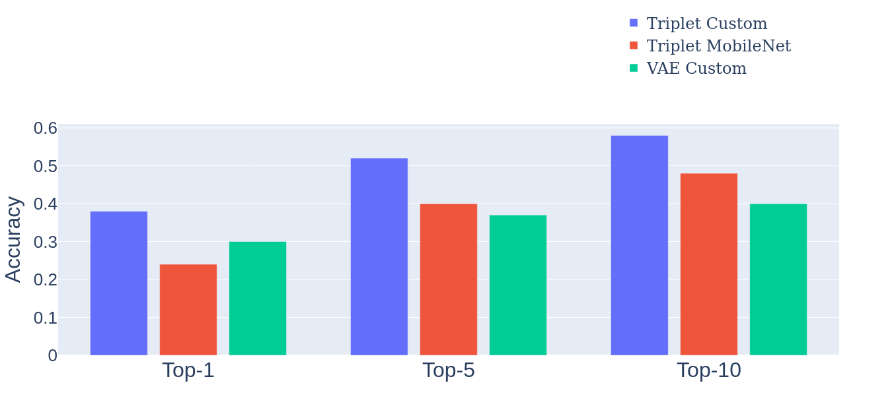

# Our prototype solution

## Access our app [here](https://sustainable-deepfashion-dash.herokuapp.com/).

# Sustainable Deepfashion
Circular fashion solves 21st century developments in the fashion industry - i.e. a growing neglect about social and environmental issues surrounding the production of clothing - by trying to build a more sustainable business model. In a circular fashion economy every piece of clothing gets recycled, rented, repaired, redesigned or resold. 
At the moment it is nonetheless quite hard to find environment-friendly sources to buy or rent from. It could also be difficult to find clothing that matches your style, as a fast fashion based brand has a larger collection to choose from.

To this end, our project will focus on building an app that lets you take or upload a picture from any piece of clothing and matches this picture to similar pieces of clothing from sustainable sources, be it fashion brands or second-hand offerings. 

The strategy is to implement one-shot learning techniques developed for face-recognition and train the model to match pictures of fashion items to that of sustainable sources. Using Tensorflow, we employ transfer learning to start with a pretrained convolutional network, e.g. the EfficientNetB0. This model is trained on the deepfashion2 dataset, as well as our own data. The output of the trained model is an embedding vector, whose L2-distance to another embedding is small if the pictures contain the same (or similar) items and large otherwise.

Finally, the user provided image is checked against a database containing sustainable fashion to provide the Top 5 closest alternatives from Ebay Kleinanzeigen, sustainable brands, or similar.

# Concept

# Top-k accuracies

